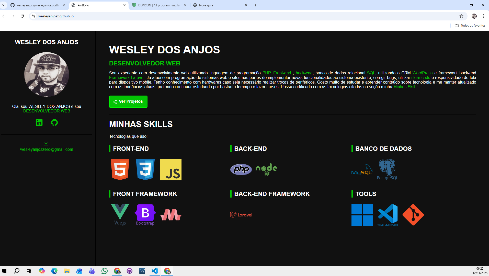

  
 
          
          

# wesleyanjosz.github.io
Portfólio

## Assunto

Este é meu portfólio com conteúdo descritivo brevemente sobre meus conhecimentos, utilização de responsivol para visualização de dispositivo mobile. Vou melhorando este portfólio com o passar do tempo adicionando mais skill de programador para registro.

## Conteúdo

- Utilização de HTML5
- Utilização de CSS3
- Utilização de CDN IONICON para logos
- Visualização mobile
- Links para projetos GitHub
- Links para o Linkedin

## Visual

